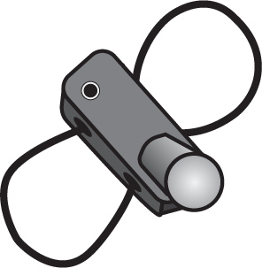
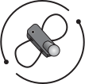
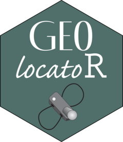
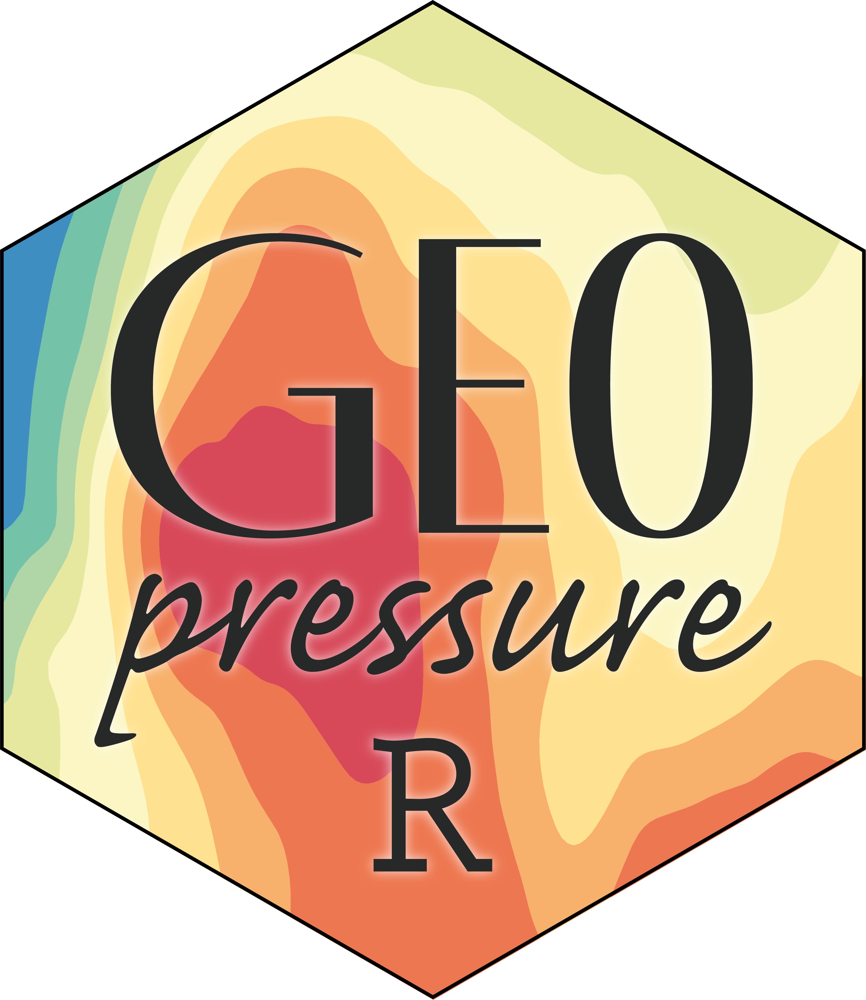

**GeoLocator Data Package** (GeoLocator DP) is a data exchange format for geolocator data. It follows the [Data Package standard](https://datapackage.org/standard/data-package/) for structuring the data.

## Structure

A GeoLocator Data Package is organized into three components: (1) the project metadata, (2) the core resources containing the main dataset, and (3) optional trajectory data generated with the [GeoPressure suite](https://raphaelnussbaumer.com/GeoPressureManual/#the-geopressure-suite).

### 1. Metadata

The description of the project and the data is contained in [`datapackage.json`](https://raphaelnussbaumer.com/GeoLocator-DP/datapackage/).

| File                                                                           | Description                                                                                                                                                                                                      |
| ------------------------------------------------------------------------------ | ---------------------------------------------------------------------------------------------------------------------------------------------------------------------------------------------------------------- |
| [`datapackage.json`](https://raphaelnussbaumer.com/GeoLocator-DP/datapackage/) | List of the project's metadata, such as the package's title, licenses, contributors, etc., as well as a list of the data [`resources`](https://datapackage.org/standard/data-resource/) that make up the package |

### 2. Core Resources

The core GeoLocator DP resources consist of the raw geolocator data. These `resources` can be generated without any analysis of the geolocator data.

| File                                                                                 | Description                                                                                           |
| ------------------------------------------------------------------------------------ | ----------------------------------------------------------------------------------------------------- |
| [`tags.csv`](https://raphaelnussbaumer.com/GeoLocator-DP/core/tags/)                 | Table of devices used in the study. We assume that a `tag` is only used once on a single animal.      |
| [`measurements.csv`](https://raphaelnussbaumer.com/GeoLocator-DP/core/measurements/) | Table with the raw measurements of all sensors (e.g., light, pressure, ...) for all tags.             |
| [`observations.csv`](https://raphaelnussbaumer.com/GeoLocator-DP/core/observations/) | Table with the field observations associated with tags such as equipment, retrieval, or other events. |

### 3. GeoPressureR Resources

The GeoPressureR extension consists of optional trajectory data generated through the [GeoPressureR workflow analysis](https://raphaelnussbaumer.com/GeoPressureManual/geopressuretemplate-workflow.html).

| File                                                                                          | Description                                                                          |
| --------------------------------------------------------------------------------------------- | ------------------------------------------------------------------------------------ |
| [`staps.csv`](https://raphaelnussbaumer.com/GeoLocator-DP/geopressurer/staps)                 | Table of the stationary periods of all tags.                                         |
| [`paths.csv`](https://raphaelnussbaumer.com/GeoLocator-DP/geopressurer/paths)                 | Table of the trajectory of all tags, typically most likely path or simulation paths. |
| [`edges.csv`](https://raphaelnussbaumer.com/GeoLocator-DP/geopressurer/edges)                 | Table containing the flight information of the edges associated with the paths.      |
| [`twilights.csv`](https://raphaelnussbaumer.com/GeoLocator-DP/geopressurer/twilights)         | Table of the twilights estimated from light data for all tags.                       |
| [`pressurepaths.csv`](https://raphaelnussbaumer.com/GeoLocator-DP/geopressurer/pressurepaths) | Table of pressure-based paths.                                                       |

## Where to find and explore GeoLocator Data Packages

<table>
    <tr style="border-top-width: 1px;">
        <td>
            
        </td>
        <td>
            You'll be able to find all GeoLocator Data Packages in the <a href="https://zenodo.org/communities/geolocator-dp/">GeoLocator Data Package Zenodo Community</a>. Once you've published your data package, make sure to <a href="https://help.zenodo.org/docs/share/submit-to-community/">submit it to the community</a>.
        </td>
    </tr>
    <tr>
        <td>
            
        </td>
        <td>
            Explore the most likely trajectories of all existing data packages on a 3D map with <a href="https://raphaelnussbaumer.com/GeoLocatorExplorer/">GeoLocatorExplorer</a>.
        </td>
    </tr>
</table>

## Ecosystem

<table>
    <tr style="border-top-width: 1px;">
        <td>
            
        </td>
        <td>
            The <a href="https://raphaelnussbaumer.com/GeoPressureManual/geolocator-intro.html">Geolocator Manual</a> R book has a dedicated part on the use of the GeoLocator Data Package. This is a great place to start learning more about how to use it with your GeoPressureTemplate project.
        </td>
    </tr>
    <tr>
        <td>
            
        </td>
        <td>
            The <a href="https://raphaelnussbaumer.com/GeoLocatoR/">GeoLocatoR</a> R package is designed to handle GeoLocator DP: creating a DP, adding resources, writing a DP, and reading a DP. It is essentially an extension of the <a href="https://docs.ropensci.org/frictionless/">frictionlessr</a> package for geolocator data.
        </td>
    </tr>
    <tr>
        <td></td>
        <td>
            <a href="https://raphaelnussbaumer.com/GeoPressureR/">GeoPressureR</a> is the main package to analyze geolocator data. Once a GeoLocator Data Package is created, GeoPressureR is our recommended software to read the data into R and analyze the data.
        </td>
    </tr>
</table>

## How to Cite

> Nussbaumer, R. (2024). GeoLocator Data Package. Zenodo. [10.5281/zenodo.14258411](https://doi.org/10.5281/zenodo.14258411)
